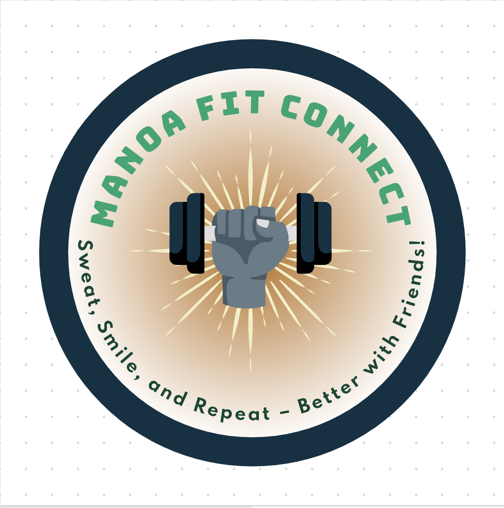

<h1 align="center" style="font-size: 28px;">Manoa Fit Connect</h1>
<p align="center"></p><br><br>


## Table of contents
* [Overview](#overview)
* [Team Members](#team-members)
* [User Guide](#user-guide)
* [Developer Guide](#developer-guide)
* [Milestone 1](#milestone-1)

## Overview

The Challenge:

For many UHM students the gym can seem like an intimidating place and going alone can feel daunting. It's not just about the lack of motivation but also the uncertainty about how to use the equipment effectively and the idea of taking on a new venture alone.

Our Solution:

On our app Manoa Fit Connect, we're all about making fitness fun, accessible, and supportive for every student. We've created a platform that connects you with gym buddies and provides the knowledge you need to feel confident in the gym environment.


## Team Members

<div style="background-color: #f2f2f2; padding: 20px; margin-bottom: 20px;">
  <h3>Hayden Bireley</h3>
  <p align="center"></p>
  <p>I am currently a Junior at UH Manoa, studying Computer Science. I have worked on independent projects but on a team making a website or application. I am looking forward to applying the skills I have learned in a team to make a good website or application.</p>
</div>

<div style="background-color: #f2f2f2; padding: 20px; margin-bottom: 20px;">
  <h3>Jerald Cascayan</h3>
  <p align="center"></p>
  <p>I am currently an undergrad senior @ UH MANOA. I am pursuing a B.Sc in Computer Sciences, and have experience in Software Engineering in Industry (startups), TA @ AI4ALL, and volunteer teaching research @ SCIMI. Currently interested in game development such as Gameplay Engineering and Game Engine Development. Looking forward for the epic coding collab sessions!</p>
</div>

<div style="background-color: #f2f2f2; padding: 20px; margin-bottom: 20px;">
  <h3>Sidney Gills</h3>
  <p align="center"></p>
  <p>I <3 ICS!!!!!!</p>
</div>

<div style="background-color: #f2f2f2; padding: 20px; margin-bottom: 20px;">
  <h3>Brandon Tabios</h3>
  <p align="center"></p>
  <p>I am a Junior at UH Manoa, double majoring in both Computer Science and German. I have experience doing many team based activities and working on many different projects. I am excited to learn more, and use what I learn into my future career.</p>
</div>

<div style="background-color: #f2f2f2; padding: 20px; margin-bottom: 20px;">
  <h3>Victoria Valverde</h3>
  <p align="center"></p>
  <p>I am currently a Junior at UH Manoa, studying for a BS in Computer Science. I have experience working on large scale projects for other fields of work but not for designing a website with a team. I’m looking forward to applying the skills I've learned to help develop this project as a collaborative effort.</p>
</div>

## User Guide

### Landing Page

This page serves as a landing page for Mano Fit Connect Platform Web App. Features / strategies employed by marketing such as, but not limited to, a clear purpose, modern UX/UI, and a strong call to action leading up to the main application. As for technical features, it should aim for a responsive design and fast loading speed, and if possible, analytics 

### About Page
### Sign Up Page
### Login Page

This page serves as a bridge towards the main application, which connects the user with their personal data tailored to our web application. It features a form that contains an input textbox for the user to enter their username / email / password, and a login button. As for technical features, the backend contains user authorization and input validation / sanitation to allow the user to enter their session

### User Profile Page
### Friends Page

This page serves as a hub for our audience to connect and share with like-minded individuals, fitness enthusiasts, to come together to inspire, motivate, and support each other in their pursuit of their personal health and body goals. The many plausible features should give users a quality social experience, such as, but not limiting too, workout buddy system, fitness goals / sharing, and friends management

### Equipment Page
### Favorite Workout Page
### Progress Tracker PAge
### Events Page

## Developer Guide

First you will need install <a href = "https://www.meteor.com/install">Meteor</a>. 
Second you will need to install <a href = "https://nodejs.org/en/download/">Node.js</a>. 
Third go to the our <a href = "https://github.com/manoa-fit-connect/manoa-fit-connect-app">github</a> and download it as a template. Fourth, cd into the /app directory and install the following:

Now cd into the app directory of the local your local copy and perform:

```
$ meteor npm install
```

Followed by:

```
$ meteor npm run start
```

Now you have a local instance running at [http://localhost:3000](http://localhost:3000)! 

After modifying the code to your liking you may check for errors by running:

`
$ meteor npm run lint
`

## Milestone 1
