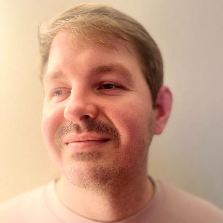

<h1 align="center" style="font-size: 28px;">Manoa Fit Connect</h1>

  

## Table of contents
* [Overview](#overview)
* [Team](#team)
* [User Guide](#user-guide)
* [Developer Guide](#developer-guide)
* [Milestone 1](#milestone-1)

## Overview

The Challenge:

For many UHM students the gym can seem like an intimidating place and going alone can feel daunting. It's not just about the lack of motivation but also the uncertainty about how to use the equipment effectively and the idea of taking on a new venture alone.

Our Solution:

On our app Manoa Fit Connect, we're all about making fitness fun, accessible, and supportive for every student. We've created a platform that connects you with gym buddies and provides the knowledge you need to feel confident in the gym environment.

## Team Members

### Hayden Bireley

I am currently a Junior at UH Manoa, studying Computer Science. I have worked on independent projects but on a team making a website or application. I am looking forward to applying the skills I have learned in a team to make a good website or application. 

### Jerald Cascayan

I am currently a Junior at UH Manoa, studying Computer Science. I have worked on independent projects but on a team making a website or application. I am looking forward to applying the skills I have learned in a team to make a good website or application.  

### Sidney Gills

I am currently a Junior at UH Manoa, studying Computer Science. I have worked on independent projects but on a team making a website or application. I am looking forward to applying the skills I have learned in a team to make a good website or application.  

### Brandon Tabios

I am currently a Junior at UH Manoa, studying Computer Science. I have worked on independent projects but on a team making a website or application. I am looking forward to applying the skills I have learned in a team to make a good website or application.  

### Victoria Valverde

I am currently a Junior at UH Manoa, studying Computer Science. I have worked on independent projects but on a team making a website or application. I am looking forward to applying the skills I have learned in a team to make a good website or application.  

## User Guide

### Landing Page
### About Page
### Sign Up Page
### Login Page
### User Profile Page
### Friends Page
### Equipment Page
### Favorite Workout Page
### Progress Tracker PAge
### Events Page

## Developer Guide

## Milestone 1
