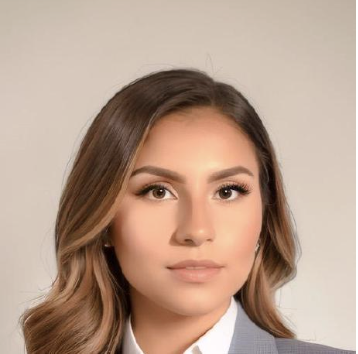

<h1 align="center" style="font-size: 28px;">Manoa Fit Connect</h1>

  

## Table of contents
* [Overview](#overview)
* [Team](#team)
* [User Guide](#user-guide)
* [Developer Guide](#developer-guide)
* [Milestone 1](#milestone-1)

## Overview

The Challenge:

For many UHM students the gym can seem like an intimidating place and going alone can feel daunting. It's not just about the lack of motivation but also the uncertainty about how to use the equipment effectively and the idea of taking on a new venture alone.

Our Solution:

On our app Manoa Fit Connect, we're all about making fitness fun, accessible, and supportive for every student. We've created a platform that connects you with gym buddies and provides the knowledge you need to feel confident in the gym environment.

## Team Members

  <h3>Hayden Bireley</h3>
  

  
I am currently a Junior at UH Manoa, studying Computer Science. I have worked on independent projects but on a team making a website or application. I am looking forward to applying the skills I have learned in a team to make a good website or application.

  <h3>Jerald Cascayan</h3>
  

  
I am currently an undergrad senior @ UH MANOA. I am pursuing a B.Sc in Computer Sciences, and have experience in Software Engineering in Industry (startups), TA @ AI4ALL, and volunteer teaching research @ SCIMI. Currently interested in game development such as Gameplay Engineering and Game Engine Development. Looking forward for the epic coding collab sessions!

  <h3>Sidney Gills</h3>
  

  
I <3 ICS!!!!!!

  <h3>Brandon Tabios</h3>
  

  
I am a Junior at UH Manoa, double majoring in both Computer Science and German. I have experience doing many team based activities and working on many different projects. I am excited to learn more, and use what I learn into my future career.

  <h3>Victoria Valverde</h3>
  

  
I am currently a Junior at UH Manoa, studying for a BS in Computer Science. I have experience working on large scale projects for other fields of work but not for designing a website with a team. I’m looking forward to applying the skills I've learned to help develop this project as a collaborative effort.

  

## User Guide

### Landing Page
### About Page
### Sign Up Page
### Login Page
### User Profile Page
### Friends Page
### Equipment Page
### Favorite Workout Page
### Progress Tracker PAge
### Events Page

## Developer Guide

## Milestone 1
