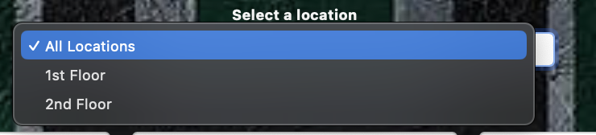
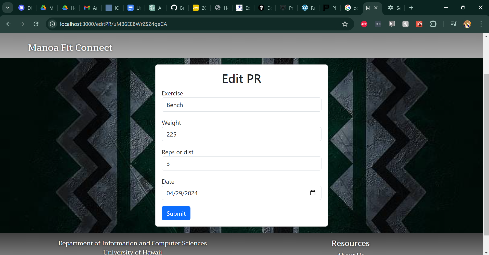

<h1 align="center" style="font-size: 28px;">Manoa Fit Connect</h1>
<div align="center">
    
</div>

## Table of contents
* [Overview](#overview)
* [User Guide](#user-guide)
* [Developer Guide](#developer-guide)
* [Community Feedback](#community-feedback)
* [Deployment](#deployment)
* [Milestone 1](#milestone-1)
* [Milestone 2](#milestone-2)
* [Milestone 3](#milestone-3)
* [Team Members](#team-members)

[Team Contract](https://docs.google.com/document/d/1DDRlp5vSKb_kA-4D7WwL9-4053rtcrNYaoZwi9vv1qU/)

## Overview


For details, please see https://manoa-fit-connect.github.io/

The Challenge:

For many UHM students the gym can seem like an intimidating place and going alone can feel daunting. It's not just about the lack of motivation but also the uncertainty about how to use the equipment effectively and the idea of taking on a new venture alone.

Our Solution:

On our app Manoa Fit Connect, we're all about making fitness fun, accessible, and supportive for every student. We've created a platform that connects you with gym buddies and provides the knowledge you need to feel confident in the gym environment.

## User Guide

### Landing Page


This page serves as a landing page for Manoa Fit Connect Platform Web App. Features / strategies employed by marketing such as, but not limited to, a clear purpose, modern UX/UI, and a strong call to action leading up to the main application. As for technical features, it should aim for a responsive design and fast loading speed, and if possible, analytics.

### About Page


This page serves to introduce the users to the team behind the app. It provides detailed information about each of our members.


This page also include directions on how to navigate our website. Users are able to select this link at the footer of our website. This is where they will find a link to the user guide.

### Sign Up Page


This page serves to register a new user to Manoa Fit Connect. It features a form that contains an input textbox for the user to enter their username / email / password, and a login button. As for technical features, the backend contains user authorization and input validation / sanitation to allow the user to enter their session.

### Login Page


This page serves as a bridge towards the main application, which connects the user with their personal data tailored to our web application. It features a form that contains an input textbox for the user to enter their username / email / password, and a login button. As for technical features, the backend contains user authorization and input validation / sanitation to allow the user to enter their session.

### User Profile Page


This page allows a user to customize their profile. The customizable fields include: profile image, first name, last name, age, gender, level, role, style, goals, availability, hobbies/sports, major, and a custom description. The idea behind the custom description field is to allow the user to add additional details to their profile, such as their routine, personal records, or diet. It is not required to customize the fields, but it will possibly allow for your profile to be searchable or filterable for other users looking to connect with a fitness buddy.


The profile customization page, as illustrated in the provided screenshot, presents a straightforward form where users can input and update their personal information. In this instance, we see a user named John Doe, a 20-year-old male who identifies as an intermediate-level fitness enthusiast. John's profile is tailored to reflect his specific interests and roles within the fitness community. His goals are centered around strength training, and his chosen style is powerlifting, indicating his focus on building muscular strength and power. This user can adjust his information as needed and our app will read and write this information


### Friends Page


This page facilitates connection and sharing among users who are motivated to achieve personal health and body goals. The design allows users to see each other's preferred workouts, workout times, and fitness goals. The intention is to create a supportive and inspiring online environment where users can form connections, such as finding workout buddies, sharing fitness goals, and managing friendships within the community. Once the Workout Buddy System is implemented, which is a core feature meant to allow users to connect and "friend" one another, is integrated, users will likely be able to directly interact with the profiles shown, send friend requests, and align their workout schedules with one another. As of now, it faciliates dynamic pagination based on the amount of friends a user has and contains front-end mockup functionality of a user's friend list.

### Equipment Page


Welcome to our equipment page! Discover gym equipment categorized by type and location. Filter by equipment type or its location within the gym to learn how to use them effectively.

Filter by Equipment Type: Choose from a variety of equipment types such as cardio machines, strength machines, free weights, and more. Learn how to use each type to maximize your workout.


Filter by Location: Select a specific area within the gym, like the cardio section, weightlifting area, or stretching zone. You'll find equipment located in that area along with instructions on how to use them.



With our detailed guides, you'll be well-informed on how to make the most of each piece of equipment. Get ready to elevate your workout experience!


### Workout Page


Welcome to our workout page! Here, you'll find a variety of exercises ranked from 1 to 5 based on difficulty. Whether you're a beginner looking for a gentle start or a fitness enthusiast seeking a challenge, we've got you covered.

You have two options for exploring our workouts:

Filter by Time: You can filter workouts based on their estimated time to compleete. Choose from 16-60 minutes, so that you can squeeze in a workout for whatever time you have. Simply select your desired time to see a list of workouts matching your preference.


Filter by Category: If you have a specific type of workout in mind, you can filter by category. We offer a range of categories such as cardio, strength training, flexability, and more. When you select a category, you'll see workouts tailored to that particular type of exercise.


Random Workout: Feeling spontaneous? Click the "Random Workout" button to let fate decide your exercise routine for the day. If you're filtering by category, the random workout generator will select from within that category. Otherwise, it will pick from our entire range of workouts.
Whether you're aiming for a full-body burn or a targeted session, you'll find something to suit your fitness goals here. Get ready to sweat, strengthen, and challenge yourself with our diverse selection of workouts!


### Progress Tracker Page


This page will allow users to log workouts and give a rating to them. Each workout will have a title, category (weight training, cardio, wellness, or other), how you would rate it from a scale 1 to 5, and also a rating on how difficult the workout was on the same scale 1 to 5. The page will also have a place to put your personal best that you are proud of and can be updated when you beat them. The personal best could be any lift or any workout. The personal best table will have what the personal best is and how reps or how long you did for.



Within the Progress Tracker section of the platform, users are presented with a dedicated interface to edit their Personal Records (PRs), as seen in the screenshot. This functionality is essential for fitness enthusiasts who want to keep a precise log of their achievements and progress over time. The form provided is simple and efficient, allowing users to quickly input the exercise they've performed, in this case, a bench press, along with the weight lifted, here specified as 220 pounds. Users can also record the number of repetitions completed, which is indicated as 3 in this example.


In the platform's Progress Tracker feature, the "Edit Workout" section allows users to meticulously document each workout session. The form shown in the screenshot invites users to detail various aspects of their workout, ensuring a comprehensive record that goes beyond basic logging. The form shown in the screenshot allows users to easily select a specific workout and modify for that specific session


### Events Page


The Events Page is a page where users are able to see upcoming events listed by anyone in the community. This page allows users to see upcoming events, the date and time of the event, and where it will take place. The page also allows you to see events of a specific month, allowing you to see previous and upcoming events.


Any user is allowed to add their own events to the page, and add their own description of how the event would be. Users could then contact them for interest towards that event.


Events are also displayed in the NavBar by seeing the bell icon. The icon indicates whether or not there is an event that is taking place within the current month and year. This selection also allows you to view the whole events page.


### Admin View


This is the admin landing page. In the future we hope to implement features for the website administrator to be able to edit default and user entered data.

### Sign Out Page


Once a user signs out they are greeted with the option to generate a goodbye from our team. The user is also able to return to our home page.

## Developer Guide

First you will need install <a href = "https://www.meteor.com/install">Meteor</a>.
Second you will need to install <a href = "https://nodejs.org/en/download/">Node.js</a>.
Third go to the our <a href = "https://github.com/manoa-fit-connect/manoa-fit-connect-app">github</a> and download it as a template. Fourth, cd into the /app directory and install the following:

Now cd into the app directory of the local your local copy and perform:

```
$ meteor npm install
```

Followed by:

```
$ meteor npm run start
```

Now you have a local instance running at [http://localhost:3000](http://localhost:3000)!

After modifying the code to your liking you may check for errors by running:

`
$ meteor npm run lint
`

## Community Feedback

Explore what our community has to say! Below, you'll find feedback straight from our users. We value your input, and this is where we showcase the ideas, suggestions, and comments that have helped shape our app. Dive in and see how your fellow users are contributing to making our platform even better.

<div style="background-color: #f2f2f2; padding: 20px; margin-bottom: 20px;">

  <h3>User 1 - Zane (Undergraduate Student at UHM)</h3>
  <p>Thoughts and Prayers-Hayden
  Pros:
  <ul>
      <li>It allows for an easier way to meet new gym friends</li>
  </ul>
    Cons:
    <ul>
      <li>Not everyone uses it so the pool might be a little small</li>
    </ul>
Things that could be added:
    <ul>
      <li>maybe an improvement leaderboard so other people can share their lifts</li>
    </ul>
</p>
  <h3>User 2 - PJ Espiritu (Undergraduate Student at UHM)</h3>

  Pros:
  <ul>
    <li>The registration process is straightforward and user-friendly.</li>
    <li>I can already tell that this is a social hub that connects based on people's expertise. You're app directly tells what this is all about</li>
    <li>The equipments page is extensive, offering a wide range of exercises and intuitive filtering capabilities.</li>
    <li>I love the idea of motivational quotes when documenting progression, very mindful in our experience</li>
  </ul>

  Cons:
  <ul>
    <li>The profile page layout could be more dynamic, utilizing the space more effectively to avoid a cluttered appearance.</li>
    <li>The friends feature seems limited, lacking interaction, which detracts from the community feel.</li>
    <li>the UI could be improved a little, with dark mode or modern color schemes.</li>
  </ul>
  
  Thoughts:
  You definitely have the core features of the web app well-established. I love the concept of a social hub for gym goers like me, offering not only a platform to track personal fitness goals but also a space to connect with others who share similar fitness interests. I think the potential growth in here is the community-driven content for UH MANOA, offering students a sense of community and school spirit. Integrating a system where students can organize and promote their own events or share fitness tips and achievements could turn the app into an essential part of us, fostering a vibrant student-led culture centered around health and wellness, which is good factor for our academics goals.


  <h3>User 3 - Ahren Isaac Diaz (Undergraduate Student at UH West Oahu)</h3>
    Pros:
  <ul>
    <li> The descriptions are clean and simple thats good.</li>
    <li> Looks good to use and feels understandable to new users</li>
    <li> I find it really easy to navigate the site.</li>
  </ul>

  Cons:
  <ul>
    <li> I think what could be added into the website is the social media of the warrior recreation center if they have. </li>
    <li> It maybe needs a FAQ section on the website then answering. To introduce users to all the possibly features. </li>
    <li> The user profile page felt lacking, I wish I could add so much more.</li>
  </ul>
  
  Thoughts:
    The website felt professional to use and looked like a good functioning site. There wasn't much that I felt a website dedicating to connecting people in fitness really needed. However, I still think there are many things that could be improved upon. Some pages felt lacking such as the user profile or the friends page. If the app is dedicated towards users connecting, it doesn't feel very connecting towards others. I think the site does however have good features for someone trying to accomplish their own fitness goals
  
  <p>Thoughts and Prayers-Sidney</p>

  <h3>User 4</h3>
  <p>Thoughts and Prayers-Tabios</p>

  <h3>User 5- Devin Romero (Undergraduate Student at UHM)</h3>
  <p>
Pros:
<ul>
<li> I like the home page I know who you are and what you want to do.</li>
<li> I like the user home the icons make it easy to find what I want.</li>
<li> Progress tracker is good. I thought the quotes changing was a nice touch. </li>
<li> Equipment page is cool. I like the info about the page at the top.</li>
<li> I like the workout page has alot of. examples and filter options. </li>
<li> Sign up was easy. </li>
<li> Signout was a fun touch would be cool if more buttons had some type of affect.</li>
</ul>
Cons:
<ul>
<li>Would be nice to filter by difficulty rating for workouts. Or users can add to the workouts for other people too.</li>
<li>Profile feels a bit plain it is all pushed to one corner?</li>
<li>Friends page is all AI generated? Cant see other people using the
app. </li>
<li>Could possibly add more available equipment.</li>
<li>Events is not on the top with the other links only on home page? This is kind of plain and then it only is asking for a a title and not a description of my actual event. Is it possible to make this look like a actual calendar?And then when i logged out the event deleted and when we used another tester profile the event did not show up for them?</li>
</ul>
Thoughts:
Over all its a nice website. There are alot of cool features. I think the look of everything is pretty cool for the initial homepage. Some of the pages are lacking in completeness? If the purpose is to connect people to real people then I should be able to see other students. I think the progress tracker does good on saving a users info and equipment and workouts does good on providing information.</p>

</div>

## Deployment

[Digital Ocean Link](https://manoafitconnect.com/)

Manoa Fit Connect is live! Check it out at:  [https://manoafitconnect.com/](https://manoafitconnect.com/)

Our application is hosted on a Digital Ocean Droplet, ensuring reliable and efficient performance for our users!


## Milestone 1


### Page Development

[M1](https://github.com/orgs/manoa-fit-connect/projects/3): The goal of Milestone 1 is to create a mockup of the pages in the system. Below is the ToDo list for the team with each person assigned to two issues. The goal is create basic functionality, a landing page, four other pages, and the sytem is deployed to Digital Ocean.


## Milestone 2


### Page Development

[M2](https://github.com/orgs/manoa-fit-connect/projects/4): The goal of Milestone 2 is to further develop and refine the pages within the system. Any tasks from Milestone 1 that have not been completed will be carried over to Milestone 2. This phase focuses on enhancing functionality, improving user interaction, and ensuring a seamless integration of all components. The team is assigned tasks as per the updated ToDo list to achieve these objectives. Additionally, the system is continually deployed and updated on Digital Ocean.

## Milestone 3


### Page Development

[M3](https://github.com/orgs/manoa-fit-connect/projects/6): The goal of Milestone 3 is to significantly improve the functionality of the gym fitness app by incorporating real data and gathering feedback from the UH community. Tasks include adding a substantial amount of real workout routines, exercises, and other fitness-related content. For example, the app should include at least 50 real workout routines with accurate descriptions and images. Additionally, the team aims to find at least five UH community members (excluding ICS 314 students) to try out the app and provide feedback on its usability and effectiveness. These tasks will be organized and executed according to the updated ToDo list. Continuous deployment and updates on Digital Ocean will ensure the app's readiness for testing and further refinement.

## Team Members

<div style="background-color: #f2f2f2; padding: 20px; margin-bottom: 20px;">
  <h3>Hayden Bireley</h3>
  <p align="center"></p>
  <p>I have worked on independent projects but this was my first time working as a team making a website or application.
          I was in charge of the Progressive Tracker page and the user landing page. The making of those pages was challenging and rewarding at the same time. It allowed my to express my creative side as well as making it easy to use for users.
          As a result of making this app, I learned the importance of teamwork and good communication with your teammate. Without it nothing would be do or done poorly and acceptable for the user.
          Also I learned that you have to respect your team time and work around their blockers.
          I am looking forward to applying the skills I have learned in this team to my next projects in the future. I have learned a lot of valuable skills in making this app.</p>
</div>

<div style="background-color: #f2f2f2; padding: 20px; margin-bottom: 20px;">
  <h3>Jerald Cascayan</h3>
  <p align="center"></p>
  <p>I am currently an undergrad senior @ UH MANOA. I am pursuing a B.Sc in Computer Sciences, and have experience in Software Engineering in Industry (startups), TA @ AI4ALL, and volunteer teaching research @ SCIMI. Currently interested in game development such as Gameplay Engineering and Game Engine Development. Looking forward for the epic coding collab sessions!</p>
</div>

<div style="background-color: #f2f2f2; padding: 20px; margin-bottom: 20px;">
  <h3>Sidney Gills</h3>
  <p align="center"></p>
  <p>I'm currently a junior majoring in Computer Science at UH Manoa. My experience includes small, individual-based projects and I'm excited to apply what I've learned towards this team-based application.</p>
</div>

<div style="background-color: #f2f2f2; padding: 20px; margin-bottom: 20px;">
  <h3>Brandon Tabios</h3>
  <p align="center"></p>
  <p>I am a Junior at UH Manoa, double majoring in both Computer Science and German. I have experience doing many team based activities and working on many different projects. I am excited to learn more, and use what I learn into my future career.</p>
</div>

<div style="background-color: #f2f2f2; padding: 20px; margin-bottom: 20px;">
  <h3>Victoria Valverde</h3>
  <p align="center"></p>
  <p>As a Junior at UH Manoa studying for a BS in Computer Science, I've had the opportunity to work on various projects, but none quite like this website development endeavor. Being in charge of creating the equipment and workout pages was both challenging and rewarding. It allowed me to dive into the design process, ensuring that users could easily access and understand our fitness resources.

Alongside this, contributing to the user guide, initial calendar, and website style has been a valuable learning experience. Despite not having prior experience in designing websites with a team, I found immense enjoyment in the collaborative process. It was gratifying to see our ideas come to life and witness the project evolve from concept to completion.

As I reflect on my role in this project, I've come to appreciate the importance of teamwork and effective communication. Each step of the design process presented its own set of challenges, but overcoming them together only strengthened our project and our bonds as a team.

While my journey as a student will soon reach its culmination with graduation in Fall 2024, I'm proud of the skills I've developed and the contributions I've made to this project. Looking back, I can confidently say that I've enjoyed every moment of the design process and am eager to apply what I've learned to future endeavors.</p>
</div>
