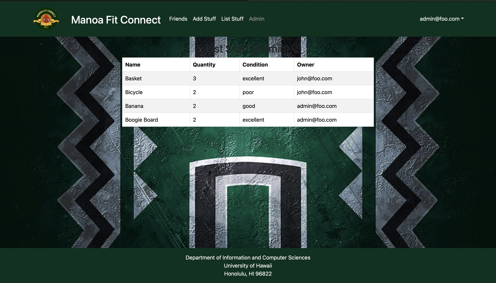

<h1 align="center" style="font-size: 28px;">Manoa Fit Connect</h1>
<div align="center">
    
</div>

## Table of contents
* [Links](#links)
* [Overview](#overview)
* [Team Members](#team-members)
* [User Guide](#user-guide)
* [Developer Guide](#developer-guide)
* [Deployment](#deployment)
* [Milestone 1](#milestone-1)
* [Milestone 2](#milestone-2)


## Links

[Github Profile](https://github.com/manoa-fit-connect)

[Team Contract](https://docs.google.com/document/d/1DDRlp5vSKb_kA-4D7WwL9-4053rtcrNYaoZwi9vv1qU/)

[Digital Ocean Link](http://64.23.246.58) Please note this version does not yet reflect Equipment or Profile Pages.

[M1](https://github.com/orgs/manoa-fit-connect/projects/3)

[M2](https://github.com/orgs/manoa-fit-connect/projects/4)

## Overview

The Challenge:

For many UHM students the gym can seem like an intimidating place and going alone can feel daunting. It's not just about the lack of motivation but also the uncertainty about how to use the equipment effectively and the idea of taking on a new venture alone.

Our Solution:

On our app Manoa Fit Connect, we're all about making fitness fun, accessible, and supportive for every student. We've created a platform that connects you with gym buddies and provides the knowledge you need to feel confident in the gym environment.


## Team Members

<div style="background-color: #f2f2f2; padding: 20px; margin-bottom: 20px;">
  <h3>Hayden Bireley</h3>
  <p align="center"></p>
  <p>I am currently a Junior at UH Manoa, studying Computer Science. I have worked on independent projects but on a team making a website or application. I am looking forward to applying the skills I have learned in a team to make a good website or application.</p>
</div>

<div style="background-color: #f2f2f2; padding: 20px; margin-bottom: 20px;">
  <h3>Jerald Cascayan</h3>
  <p align="center"></p>
  <p>I am currently an undergrad senior @ UH MANOA. I am pursuing a B.Sc in Computer Sciences, and have experience in Software Engineering in Industry (startups), TA @ AI4ALL, and volunteer teaching research @ SCIMI. Currently interested in game development such as Gameplay Engineering and Game Engine Development. Looking forward for the epic coding collab sessions!</p>
</div>

<div style="background-color: #f2f2f2; padding: 20px; margin-bottom: 20px;">
  <h3>Sidney Gills</h3>
  <p align="center"></p>
  <p>I'm currently a junior majoring in Computer Science at UH Manoa. My experience includes small, individual-based projects and I'm excited to apply what I've learned towards this team-based application.</p>
</div>

<div style="background-color: #f2f2f2; padding: 20px; margin-bottom: 20px;">
  <h3>Brandon Tabios</h3>
  <p align="center"></p>
  <p>I am a Junior at UH Manoa, double majoring in both Computer Science and German. I have experience doing many team based activities and working on many different projects. I am excited to learn more, and use what I learn into my future career.</p>
</div>

<div style="background-color: #f2f2f2; padding: 20px; margin-bottom: 20px;">
  <h3>Victoria Valverde</h3>
  <p align="center"></p>
  <p>I am currently a Junior at UH Manoa, studying for a BS in Computer Science. I have experience working on large scale projects for other fields of work but not for designing a website with a team. I’m looking forward to applying the skills I've learned to help develop this project as a collaborative effort.</p>
</div>

## User Guide

### Landing Page


This page serves as a landing page for Manoa Fit Connect Platform Web App. Features / strategies employed by marketing such as, but not limited to, a clear purpose, modern UX/UI, and a strong call to action leading up to the main application. As for technical features, it should aim for a responsive design and fast loading speed, and if possible, analytics.

### About Page


This page will serve to introduce the users to the team behind the app. In the future this page will also include directions on how to navigate our website and contact info for user assistance.

### Sign Up Page


This page serves to register a new user to Manoa Fit Connect. It features a form that contains an input textbox for the user to enter their username / email / password, and a login button. As for technical features, the backend contains user authorization and input validation / sanitation to allow the user to enter their session.

### Login Page


This page serves as a bridge towards the main application, which connects the user with their personal data tailored to our web application. It features a form that contains an input textbox for the user to enter their username / email / password, and a login button. As for technical features, the backend contains user authorization and input validation / sanitation to allow the user to enter their session.

### User Profile Page


This page allows a user to customize their profile. The customizable fields include: profile image, first name, last name, age, gender, level, role, style, goals, availability, hobbies/sports, major, and a custom description. The idea behind the custom description field is to allow the user to add additional details to their profile, such as their routine, personal records, or diet. It is not required to customize the fields, but it will possibly allow for your profile to be searchable or filterable for other users looking to connect with a fitness buddy.

### Friends Page


This page serves as a hub for our audience to connect and share with like-minded individuals, fitness enthusiasts, to come together to inspire, motivate, and support each other in their pursuit of their personal health and body goals. The many plausible features should give users a quality social experience, such as, but not limiting too, workout buddy system, fitness goals / sharing, and friends management.

### Equipment Page


This page allows a user to search or browse categories for equipment by strength, cardio, wellness or all equipment. Once a user selects an option they are brought to its webpage with all equipment offered and the option to search for a specific piece of equipment. Each piece of equipment has a link to its location on the gym map and a list of exercises that can be done with it. Users can add the equipment to their workout for their favorite workouts page.

### Favorite Workout Page


The Favorite Workout Page serves as a personalized hub for users to curate and organize their preferred exercises and routines. With a simple click, users can seamlessly add favorite routines or equipment to their workout folder, streamlining the process of building and maintaining their ideal fitness regimen.

### Progress Tracker Page


This page will allow users to log workouts and give a rating to them. Each workout will have a title, category (weight training, cardio, wellness, or other), how you would rate it from a scale 1 to 5, and also a rating on how difficult the workout was on the same scale 1 to 5. The page will also have a place to put your personal best that you are proud of and can be updated when you beat them. The personal best could be any lift or any workout. The personal best table will have what the personal best is and how reps or how long you did for.

### Events Page

For the events page, this page will be an online calendar that will showcase the events that we'll be hosting as well as allowing people to hold their own events, such as people wanting to work together, or a gym buddy able to teach a group.

### Admin View



This is the admin landing page. In the future we hope to implement features for the website administrator to be able to edit default and user entered data.


## Developer Guide

First you will need install <a href = "https://www.meteor.com/install">Meteor</a>.
Second you will need to install <a href = "https://nodejs.org/en/download/">Node.js</a>.
Third go to the our <a href = "https://github.com/manoa-fit-connect/manoa-fit-connect-app">github</a> and download it as a template. Fourth, cd into the /app directory and install the following:

Now cd into the app directory of the local your local copy and perform:

```
$ meteor npm install
```

Followed by:

```
$ meteor npm run start
```

Now you have a local instance running at [http://localhost:3000](http://localhost:3000)!

After modifying the code to your liking you may check for errors by running:

`
$ meteor npm run lint
`

## Deployment

Manoa Fit Connect is live! Check it out at [http://64.23.246.58/](http://64.23.246.58/). Our application is hosted on a Digital Ocean Droplet, ensuring reliable and efficient performance for our users.

Please note this version of Digital Ocean does not yet reflect the Equipment or Profile pages.


## Milestone 1


### Page Development

[M1](https://github.com/orgs/manoa-fit-connect/projects/3): The goal of Milestone 1 is to create a mockup of the pages in the system. Below is the ToDo list for the team with each person assigned to two issues. The goal is create basic functionality, a landing page, four other pages, and the sytem is deployed to Digital Ocean.


## Milestone 2


### Page Development

[M2](https://github.com/orgs/manoa-fit-connect/projects/4): The goal of Milestone 2 is to further develop and refine the pages within the system. Any tasks from Milestone 1 that have not been completed will be carried over to Milestone 2. This phase focuses on enhancing functionality, improving user interaction, and ensuring a seamless integration of all components. The team is assigned tasks as per the updated ToDo list to achieve these objectives. Additionally, the system is continually deployed and updated on Digital Ocean.

## Links

[Github Profile](https://github.com/manoa-fit-connect)

[Team Contract](https://docs.google.com/document/d/1DDRlp5vSKb_kA-4D7WwL9-4053rtcrNYaoZwi9vv1qU/)

[Digital Ocean Link](http://64.23.246.58)
